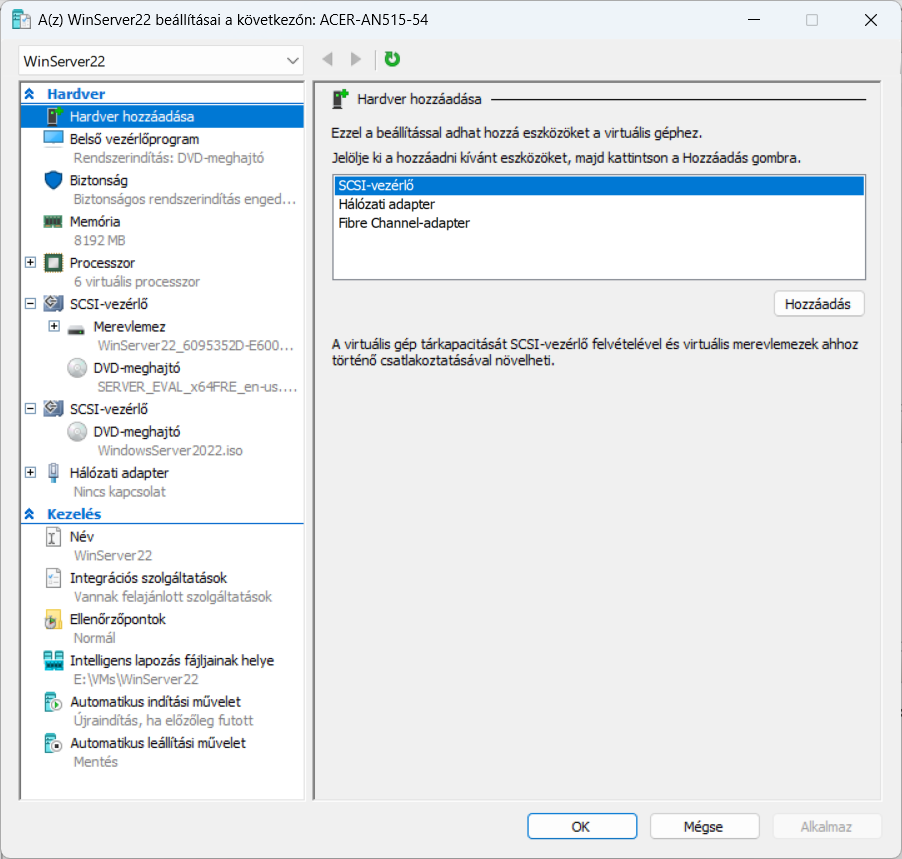
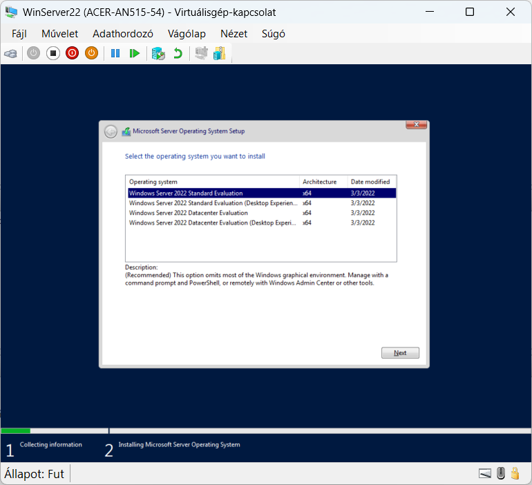
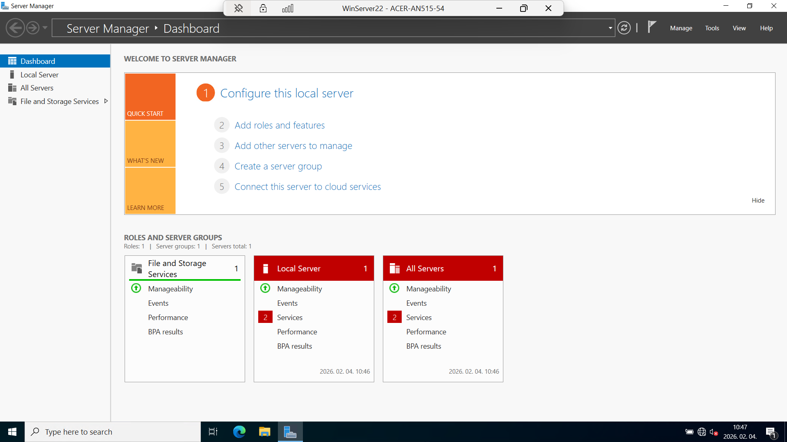

# 🖥️ Hyper-V Homelab – Windows Server Virtualizáció

> Windows Server 2022 telepítése és menedzselése Hyper-V környezetben, checkpoint kezelés és disaster recovery gyakorlat.


---

## 📋 Projekt leírás

Ez a projekt egy otthoni labor (homelab) környezet felépítését dokumentálja Hyper-V virtualizációval. A cél egy Windows Server 2022 Datacenter telepítése virtuális gépként, checkpoint-ok kezelése, valamint a disaster recovery (visszaállítási) folyamatok gyakorlása.

### Projekt célok:
- Windows Server 2022 telepítése Hyper-V virtuális gépre
- VM lifecycle management (indítás, leállítás, konfiguráció)
- Checkpoint (pillanatkép) létrehozása és kezelése
- Disaster recovery: visszaállítás checkpoint-ból
- A teljes folyamat dokumentálása screenshotokkal

---

## 🏠 Homelab infrastruktúra

```
Internet
   │
   ▼
┌──────────────┐
│  Központi     │
│  Router       │
└──────┬───────┘
       │
       ▼
┌──────────────┐
│   Switch      │
│  (UTP + WiFi) │
└──┬───┬───┬───┘
   │   │   │
   │   │   ├──► Acer AN515-54 Laptop (Hyper-V Host)
   │   │   │    ├── Windows 11 Pro
   │   │   │    ├── 16 GB RAM
   │   │   │    └── VM: WinServer22 (8 GB RAM)
   │   │   │
   │   │   ├──► Synology NAS (DS215J)
   │   │   │
   │   │   ├──► HP Laptop (Windows 11)
   │   │   │
   │   │   └──► Ubuntu Desktop
   │   │
   │   └──► Konyhai Router (Access Point)
   │        ├── Smart TV
   │        ├── Telefonok
   │        └── Egyéb IoT eszközök
   │
   └──► Közvetlen WiFi eszközök
```

---

## 🚀 Telepítési útmutató

### Előfeltételek

| Követelmény | Minimum | Ajánlott |
|-------------|---------|----------|
| OS | Windows 10/11 Pro | Windows 11 Pro |
| RAM | 8 GB | 16 GB |
| Szabad tárhely | 40 GB | 80 GB+ |
| CPU | Virtualizáció támogatás (VT-x/AMD-V) | Multi-core |
| Hyper-V | Engedélyezve | Engedélyezve |

### 1. Hyper-V engedélyezése

```powershell
# Hyper-V funkció engedélyezése (Admin PowerShell)
Enable-WindowsOptionalFeature -Online -FeatureName Microsoft-Hyper-V -All
```

Vagy: **Vezérlőpult > Programok > Windows-funkciók be- és kikapcsolása > Hyper-V** ✔️

### 2. Windows Server ISO letöltése

- Forrás: [Microsoft Evaluation Center](https://www.microsoft.com/en-us/evalcenter/evaluate-windows-server-2022)
- Verzió: Windows Server 2022 Datacenter Evaluation (Desktop Experience)
- 180 napos ingyenes próbaverzió

### 3. Virtuális gép létrehozása

1. **Hyper-V Manager** megnyitása (`virtmgmt.msc`)
2. **New > Virtual Machine** (Új > Virtuális gép)
3. Beállítások:

| Beállítás | Érték |
|-----------|-------|
| Név | WinServer22 |
| Generation | Generation 1 |
| RAM | 8192 MB (Dynamic Memory) |
| Hálózat | Default Switch |
| Virtuális lemez | 60 GB (dinamikusan bővülő) |
| ISO | Windows Server 2022 .iso |

4. **Finish** > VM létrejön

### 4. Windows Server telepítése

1. VM indítása: **Start** > **Connect**
2. Boot az ISO-ból
3. Verzió kiválasztása: **Datacenter Evaluation (Desktop Experience)**
4. Telepítés típusa: **Custom: Install Windows only**
5. Partíció kiválasztása > **Next**
6. Telepítés befejezése, Administrator jelszó beállítása

> ⚠️ **Fontos**: Ha "The boot loader failed" hibát kapsz, ellenőrizd:
> - BIOS beállítások: CD/DVD legyen az első a boot sorrendben
> - DVD Drive: ISO fájl megfelelően csatolva van-e
> - Részletek: [TROUBLESHOOTING.md](TROUBLESHOOTING.md)

---

## 📸 Screenshotok

### VM beállítások


### OS verzió kiválasztása


### Server Manager Dashboard


### Checkpoint létrehozása


### Checkpoint sikeresen létrehozva


---

## ✅ Checkpoint (Pillanatkép) kezelés

### Mi az a Checkpoint?
A checkpoint a VM egy adott időpontbeli állapotának pillanatképe. Lehetővé teszi a VM visszaállítását egy korábbi, ismert jó állapotra.

### Checkpoint létrehozása

**GUI módszer:**
1. Hyper-V Manager > Jobb klikk a VM-re > **Checkpoint**
2. Opcionális: Átnevezés (pl. "Clean Install - 2026-02-04")

**PowerShell módszer:**
```powershell
# Checkpoint létrehozása
Checkpoint-VM -Name "WinServer22" -SnapshotName "Clean Install"

# Checkpointok listázása
Get-VMSnapshot -VMName "WinServer22"
```

### Checkpoint visszaállítása

> ⚠️ **Fontos**: A VM-nek **leállított** állapotban kell lennie a visszaállításhoz! Ha a VM fut, az "Alkalmaz" opció nem lesz elérhető.

**GUI módszer:**
1. VM leállítása: Jobb klikk > **Shut Down** vagy **Turn Off**
2. Ellenőrzőpontok panel (alul) > Jobb klikk a kívánt checkpoint-ra
3. **Alkalmaz...** (Apply)
4. Választás:
   - "Ellenőrzőpont létrehozása és alkalmazása" (biztonságosabb)
   - "Alkalmaz" (csak visszaáll)

**PowerShell módszer:**
```powershell
# VM leállítása
Stop-VM -Name "WinServer22"

# Checkpoint visszaállítása
Restore-VMSnapshot -Name "Clean Install" -VMName "WinServer22" -Confirm:$false

# VM újraindítása
Start-VM -Name "WinServer22"
```

---

## 🔧 Hasznos PowerShell parancsok

```powershell
# VM-ek listázása
Get-VM

# VM állapot lekérdezése
Get-VM -Name "WinServer22" | Select-Object Name, State, Uptime, MemoryAssigned

# VM indítása / leállítása
Start-VM -Name "WinServer22"
Stop-VM -Name "WinServer22"

# VM újraindítása
Restart-VM -Name "WinServer22"

# Checkpoint műveletek
Checkpoint-VM -Name "WinServer22" -SnapshotName "Checkpoint neve"
Get-VMSnapshot -VMName "WinServer22"
Restore-VMSnapshot -Name "Checkpoint neve" -VMName "WinServer22" -Confirm:$false
Remove-VMSnapshot -VMName "WinServer22" -Name "Régi checkpoint"

# VM információk
Get-VMProcessor -VMName "WinServer22"
Get-VMMemory -VMName "WinServer22"
Get-VMHardDiskDrive -VMName "WinServer22"
Get-VMNetworkAdapter -VMName "WinServer22"
```

---

## 🐛 Troubleshooting

| Probléma | Megoldás |
|----------|---------|
| "The boot loader failed" | BIOS > Boot order: CD/DVD első helyre |
| ISO nem bootol | DVD Drive > Browse > ISO újra csatolása |
| VM lassú | RAM csökkentése, Dynamic Memory bekapcsolása |
| Checkpoint "Alkalmaz" szürke | **VM-et le kell állítani** a visszaállítás előtt! |
| Hálózat nem működik | Virtual Switch Manager > External/Internal switch |
| Kevés lemezterület | Régi checkpoint-ok törlése (helyet foglalnak!) |

Részletes hibaelhárítás: [TROUBLESHOOTING.md](TROUBLESHOOTING.md)

---

## 📚 Tanulási célok

Ez a projekt az alábbi IT üzemeltetési készségeket fejleszti:

- **Virtualizáció**: Hyper-V architektúra és VM lifecycle management
- **Windows Server**: Telepítés, alapkonfiguráció, Server Manager használata
- **Disaster Recovery**: Checkpoint-alapú visszaállítási stratégiák
- **PowerShell**: VM-ek kezelése parancssorból
- **Dokumentáció**: IT infrastruktúra dokumentálási gyakorlat
- **Troubleshooting**: Hibakeresés és megoldás virtualizált környezetben

---

## 🔜 Következő lépések

- [ ] Active Directory Domain Controller konfiguráció
- [ ] DNS szerver beállítása
- [ ] DHCP szerver konfiguráció
- [ ] Második VM hozzáadása (kliens gép)
- [ ] Hálózati szegmentáció Virtual Switch-ekkel
- [ ] Automatizált backup stratégia

---

## 👤 Szerző

**Magyar Gyula**
- GitHub: [@magyargyula](https://github.com/magyargyula)
- Portfolio: [magyargyula.github.io](https://magyargyula.github.io)

---

*Ez a projekt tanulási és portfólió célokat szolgál.*
